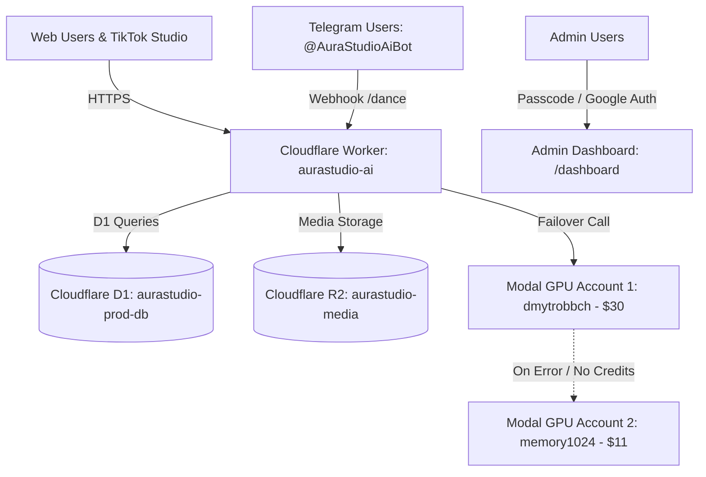

# AuraStudio AI Platform: Architecture & Runbook

This document defines the core architecture, credentials mapping, deployment runbooks,
and multi-account failover mechanics for AuraStudio AI.

---

## 1. 🏗️ High-Level System Architecture



---

## 2. ⚡ Multi-Account Modal GPU Failover System

AuraStudio utilizes an automatic dual-account failover system so that GPU inference never fails even if one account runs out of credits:

| Account Name | Initial Balance | Purpose | Photo DiT Endpoint | Video Dance Endpoint |
|---|---|---|---|---|
| `dmytrobbch` | **$30** | Primary Workspace | `https://dmytrobbch--qwen-image-edit-fp8-service-qweneditorfp8-api-edit.modal.run` | `https://dmytrobbch--aurastudio-video-dance-service-videodanceengine-api-dance.modal.run` |
| `memory1024` | **$11** | Secondary / Fallback | `https://memory1024--qwen-image-edit-fp8-service-qweneditorfp8-api-edit.modal.run` | `https://memory1024--aurastudio-video-dance-service-videodanceengine-api-dance.modal.run` |

### Failover Helper (`callModalWithFallback` in `src/worker.js`):
Whenever any service (Web Photo, Web Dance Video, or Telegram Bot) needs GPU compute, it queries `callModalWithFallback(endpoints, payload)`. If the primary endpoint responds with 402, 500, or network error, it automatically routes the request to the secondary endpoint seamlessly.

### Cost Optimization:
- `scaledown_window = 45` seconds on Nvidia A10G (24GB VRAM).
- Total isolated cold-to-stop lifecycle costs **~$0.02** per run.

---

## 3. ⭐️ Unified Telegram Stars Monetization & Identity Merge

- **Feature Flag:** `TELEGRAM_ONLY_PAYMENTS: true` in `wrangler.jsonc` and `src/worker.js`.
- **Pricing & Quotas:**
  - 1 free photo/video per 24 hours.
  - Subsequent photos: **10 Telegram Stars** (deducted from `users.stars_balance`).
  - Subsequent dance videos: **40 Telegram Stars** (deducted from `users.stars_balance`).
  - Starter Pack: **250 Stars** (50 generations).
  - Unlimited Pro: **500 Stars** (Monthly unlimited).
- **Identity Merge:** Google-authenticated web users can purchase Stars via the Telegram bot; the bot webhook inspects `payload.user_id` and credits the Stars directly to their Google profile on the Web.

---

## 4. 🗄️ Database Schema & Storage (D1 & R2)

### Cloudflare D1 (`aurastudio-prod-db`):
- `users`: User profiles, Google/Telegram IDs, `stars_balance`.
- `generations`: Task IDs, prompts, presets, duration, status, image/video URLs.
- `telemetry_events`: Real-time telemetry events (`GENERATION_SUCCESS`, `VIDEO_DANCE_GENERATION`, `STARS_PURCHASE`).
- `error_logs`: Real-time error logs (`context`, `error_message`, `user_id`, `details`, `created_at`) queried directly by `/dashboard`.

### Cloudflare R2 (`aurastudio-media`):
- All generated photos and videos are stored in R2 and served via `/media/*` route on Cloudflare Worker with HTTP caching (`Cache-Control: public, max-age=31536000`).

---

## 5. 🤖 Telegram Bot Webhook Standards

- **Bot Username:** `@AuraStudioAiBot`
- **Serverless Webhook Handler:** `src/worker.js` (`/api/telegram-webhook`)
- **Direct Video Generation:** `/dance` command with inline styles (*Viral House Shuffle*, *K-Pop Hip-Hop*, *Electro Rave*, *Latina Salsa*) responds directly with MP4 videos via `sendTgVideo`.
- **Important Note on Conflicts:** Never run local polling (`getUpdates` via `python telegram_star_bot.py`) on local machines/ITX while the Cloudflare Webhook is active, as Telegram will reject requests with `telegram.error.Conflict`.

---

## 6. 🚀 Deployment & CI/CD Runbook

### GitHub Actions Secrets (`Babych/aurastudio-platform`):
- `CLOUDFLARE_ACCOUNT_ID`: `da9d897a45e91c7e95572db2423e01fa`
- `CLOUDFLARE_API_TOKEN`: Active Cloudflare API token for Workers/Pages
- `MODAL_TOKEN_ID` & `MODAL_TOKEN_SECRET`: `dmytrobbch` credentials
- `MODAL_TOKEN_ID_SECONDARY` & `MODAL_TOKEN_SECRET_SECONDARY`: `memory1024` credentials

### Manual CLI Deployment:
- **Cloudflare Worker & Frontend:**
  ```bash
  npx wrangler deploy
  ```
- **Modal Cloud GPU:**
  ```bash
  python -m modal deploy modal/video_dance_service.py
  ```
- **D1 Schema Update:**
  ```bash
  npx wrangler d1 execute aurastudio-prod-db --file=web/schema.sql --remote
  ```
