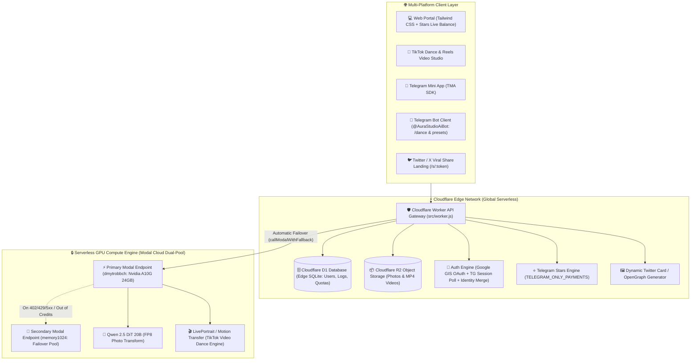

# 🎨 AuraStudio AI — Full-Stack Serverless Generative AI Platform

> **Magazine-grade portraits, TikTok Dance video retargeting, and luxury styling powered by Qwen 2.5 DiT Diffusion Transformer, LivePortrait GPU Engine, Cloudflare Serverless Edge, and Telegram Stars Monetization.**

[](https://aurastudio-ai.memory1024.workers.dev/)
[](https://aurastudio-ai.memory1024.workers.dev/dashboard)
[](https://t.me/AuraStudioAiBot)
[](LICENSE)

---

## 🏛️ System Architecture



---

## ✨ Core Features & Technical Highlights

### 1. 🕺 TikTok Dance & Reels Character Retargeting
- **AI Motion Synthesis**: Animate any static photo or selfie into viral dance routines (*Viral House Shuffle*, *K-Pop Hip-Hop*, *Electro Rave*, *Latina Salsa*) using LivePortrait/DiT on Nvidia A10G GPUs.
- **Native Telegram Bot `/dance` Command**: Generate TikTok videos directly inside Telegram chat with MP4 video binary responses via Telegram `sendVideo`.
- **Web Studio Integration**: Dedicated interactive TikTok Dance tab with real-time video player.

### 2. ⚡ Dual-Account Modal GPU Failover ($30 + $11 Balance Pools)
- **Zero-Downtime Multi-Workspace Routing**: Cloudflare Worker uses `callModalWithFallback` to automatically switch between primary (`dmytrobbch` - $30) and secondary (`memory1024` - $11) GPU workspaces upon error or credit exhaustion.
- **Aggressive Cost Optimization**: GPU `scaledown_window` tuned to **45 seconds**, reducing isolated lifecycle cost to **~$0.02** (~80 kopiykas) per generation.

### 3. ⭐️ Unified Telegram Stars Monetization & Identity Merge
- **`TELEGRAM_ONLY_PAYMENTS: true`**: Frictionless 1-click mobile checkout via Telegram Stars without banking or merchant bureaucracy.
- **Cross-Platform Identity Merging**: Users signed in via Google on the Web can pay with Telegram Stars; payments are automatically linked and credited to their Web account.
- **Real-Time Balance Badge**: Header displays live `⭐ 250 Stars` balance synced with Cloudflare D1.
- **Quota Model**: 1 free photo/video per day; additional photo = **10 Stars**, video = **40 Stars**.

### 4. 🗄️ Resilient Edge Database & Media Storage (D1 + R2)
- **Cloudflare D1**: Persistent tables for `users`, `generations`, `telemetry_events`, and `error_logs`.
- **Cloudflare R2 (`aurastudio-media`)**: Large images and video files stored with fast global CDN caching via `/media/*`.

### 5. 🔒 Secured Visual Telemetry Dashboard
- **Live Business Analytics**: Real-time stats on total users, generation volume, Stars balance, and error logs (`/dashboard`).
- **Critical Error Logging**: `logCriticalError` captures GPU and webhook exceptions into D1 silently.

---

## 📂 Project Structure

```text
aurastudio-platform/
├── src/
│   └── worker.js             # Cloudflare Edge Worker API Gateway, Failover & Telegram Webhook
├── modal/
│   └── video_dance_service.py# Modal GPU Serverless TikTok Dance Engine (A10G, scaledown=45s)
├── web/
│   ├── index.html            # Main Web Studio & TikTok Dance Studio (Tailwind CSS + GIS)
│   ├── dashboard.html        # Real-time Telemetry & Critical Error Log Dashboard
│   ├── schema.sql            # Cloudflare D1 Database Relational Schema
│   └── assets/presets/       # Synthetic AI Style Presets
├── .agents/
│   └── skills/               # Antigravity Persistent Agent Architecture Skills
├── .github/
│   └── workflows/
│       └── deploy.yml        # Automated CI/CD (Cloudflare Edge + Dual Modal GPU Deploy)
├── wrangler.jsonc            # Cloudflare Worker, D1 & R2 Configuration
├── requirements.txt          # Python dependencies
└── README.md                 # Complete system documentation & runbook
```

---

## 🚀 Deployment & CI/CD Runbook

The platform uses automated GitHub Actions CI/CD (`.github/workflows/deploy.yml` on `ubuntu-latest`):

### GitHub Actions Secrets:
* `CLOUDFLARE_ACCOUNT_ID`: `da9d897a45e91c7e95572db2423e01fa`
* `CLOUDFLARE_API_TOKEN`: Cloudflare Workers & Pages API token
* `MODAL_TOKEN_ID` & `MODAL_TOKEN_SECRET`: Primary Modal account (`dmytrobbch`)
* `MODAL_TOKEN_ID_SECONDARY` & `MODAL_TOKEN_SECRET_SECONDARY`: Secondary Modal account (`memory1024`)

### Manual CLI Commands:
```bash
# Deploy Cloudflare Edge & Static Assets
npx wrangler deploy

# Deploy Modal Cloud GPU Video Dance Engine
python -m modal deploy modal/video_dance_service.py

# Apply Database Migrations to Cloudflare D1
npx wrangler d1 execute aurastudio-prod-db --file=web/schema.sql --remote
```
