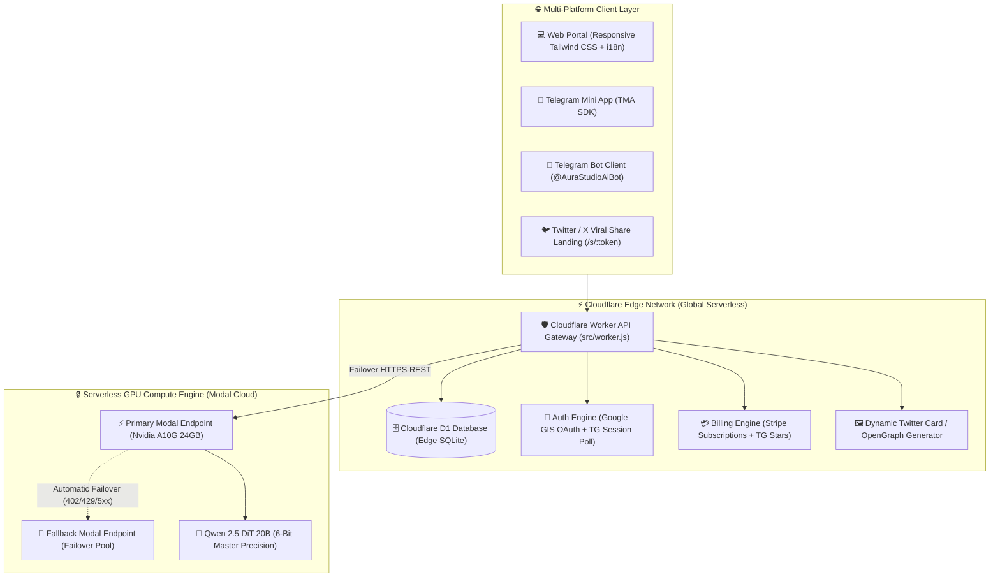

# 🎨 AuraStudio AI — Full-Stack Serverless Generative AI Platform

> **Magazine-grade portraits, LinkedIn headshots, and luxury styling powered by Qwen 2.5 DiT Diffusion Transformer, Cloudflare Serverless Edge, and Multi-Platform Billing (Stripe + Telegram Stars).**

[](https://aurastudio-ai.memory1024.workers.dev/)
[](https://aurastudio-ai.memory1024.workers.dev/dashboard)
[](https://t.me/AuraStudioAiBot)
[](LICENSE)

---

## 🏛️ System Architecture



---

## ✨ Core Features & Technical Highlights

### 1. 🌐 Modern Web Studio UI & Experience
- **Glassmorphism Dark UI**: Built with Tailwind CSS, Lucide icons, smooth responsive layouts, and drag-and-drop image uploads.
- **Bilingual Internationalization**: Dynamic runtime language switcher (EN / UK) with full localized UI dictionaries.
- **Curated Synthetic Presets**: Pre-calibrated 1-click styles (LinkedIn Business Pro, Old Money Cashmere, Bali Sunset Travel, Platinum Blonde Hair) rendered from 100% synthetic AI reference models.

### 2. 🔐 Dual Enterprise Authentication
- **Google Identity Services (GIS)**: 1-click seamless OAuth sign-in with JWT token verification.
- **Telegram Deep-Link Login**: QR code challenge and live polling session mechanism for desktop browsers without requiring passwords.
- **Anti-Abuse Rate Limiter**: 1 free daily generation quota strictly enforced in Cloudflare D1 per authenticated user.

### 3. 💳 Hybrid Monetization & Billing Orchestration
- **Stripe Subscriptions**: Automated checkout sessions ($9.99/mo Starter, $19.99/mo Unlimited) with webhook event ingestion.
- **Telegram Stars (XTR)**: In-app digital currency payments (250 ⭐ Starter, 500 ⭐ Unlimited) with pre-checkout and invoice validation.

### 4. 🚀 Viral Growth & Tokenized Social Sharing
- **1-Click Share to X / Twitter**: Generates a secure tokenized URL (`/s/:token`).
- **Dynamic OpenGraph & Twitter Cards**: Cloudflare Worker dynamically constructs `summary_large_image` meta tags with direct image binary serving (`/api/image/:taskId.png`), rendering interactive previews across Twitter, Discord, and messaging apps.

### 5. 🔒 Secured Visual Telemetry Dashboard
- **Live Business & AI Analytics**: Tracks total users, generations, USD/Stars revenue, and GPU latency.
- **Visual Task Journal**: Real-time inspection of input/output images with full audit history.
- **Admin Passcode Protection**: Protected with `X-Admin-Key` header and password modal, preventing unauthorized access to user metrics.

---

## 📂 Project Structure

```text
aurastudio-platform/
├── src/
│   └── worker.js             # Cloudflare Edge Worker API Gateway & Routes
├── web/
│   ├── index.html            # Main B2C Web Studio Application (Tailwind + GIS)
│   ├── dashboard.html        # Real-time Visual Telemetry Dashboard (Admin Protected)
│   ├── schema.sql            # Cloudflare D1 Database Relational Schema
│   ├── assets/presets/       # 100% Synthetic AI Showcase Presets
│   └── functions/api/        # Cloudflare Pages API Functions (Generate, Stats, Telemetry)
├── creative_editor_bot.py    # Standalone Telegram Photo Styling Bot Client
├── aura_dashboard.py         # Local Python Telemetry Visualizer
├── monitoring_dashboard.py   # Background Process & Node Monitor
├── wrangler.jsonc            # Cloudflare Worker & D1 Binding Configuration
├── requirements.txt          # Python dependencies
├── .env.example              # Environment variables template
└── README.md                 # Technical documentation & portfolio overview
```

---

## 🚀 Getting Started & Deployment

### 1. Prerequisites
- [Node.js](https://nodejs.org/) (v18+) & `wrangler` CLI (`npm install -g wrangler`)
- [Cloudflare Account](https://dash.cloudflare.com/) with D1 Database enabled
- [Python 3.10+](https://www.python.org/) for local bots and telemetry daemons

### 2. Cloudflare D1 Database Setup
```bash
# 1. Create remote D1 Database
npx wrangler d1 create aurastudio-prod-db

# 2. Execute SQL Schema
npx wrangler d1 execute aurastudio-prod-db --remote --file=./web/schema.sql
```

### 3. Environment Configuration
Copy the `.env.example` file and configure your API credentials:
```bash
cp .env.example .env
```

| Variable | Description | Required |
|---|---|---|
| `BOT_TOKEN` | Telegram Bot API Token from @BotFather | Yes |
| `MODAL_ENDPOINT_URL` | Primary Modal Serverless GPU Endpoint | Yes |
| `ADMIN_SECRET` | Secret Passkey for Telemetry Dashboard | Yes |
| `STRIPE_SECRET_KEY` | Stripe Secret Key for Subscriptions | Optional |
| `GOOGLE_CLIENT_ID` | Google OAuth Client ID for GIS | Optional |

### 4. Deploy to Cloudflare Edge
```bash
npx wrangler deploy
```

---

## 🔒 Security & Privacy Notice
- All user generations are private by default and only accessible to the authorized user unless explicitly shared via tokenized links.
- Admin Telemetry is strictly password-protected.
- Model execution is handled serverlessly on isolated GPU workers.

---

## 📄 License
This project is licensed under the [MIT License](LICENSE).
